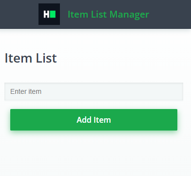

# Item List Manager 

You are tasked with creating creating a simple React application called "Item List Manager" that displays a list of items and allows users to add new items to the list. The item will be displayed in an unordered list (```<ul>```), and there will be an input field along with a button to add new items to the list.




**Detailed Requirements**

1. When the applicayion loads, it should display an empty list.
2. The input field should accept user text input.
3. When the button is clicked:
4. The text from the input field should be addedd to the list.
5. The input field should be cleared.
6. If the input fielf is empty and the button is clicked, nothing should be addedd to the list.

**Sample Interaction**  
**Initial State**

- The list is empty.
- The input field is empty.

**User Action 1**

- User types "First Item" in the input field.
- User clicks "Add Item" button.
- The list displays "Fist Item".
  
**User Action 2**

- User types "Second Item" in the input field.
- User clicks "Add item" button.
- The list displays:
  - "First Item"
  - "Second Item"
